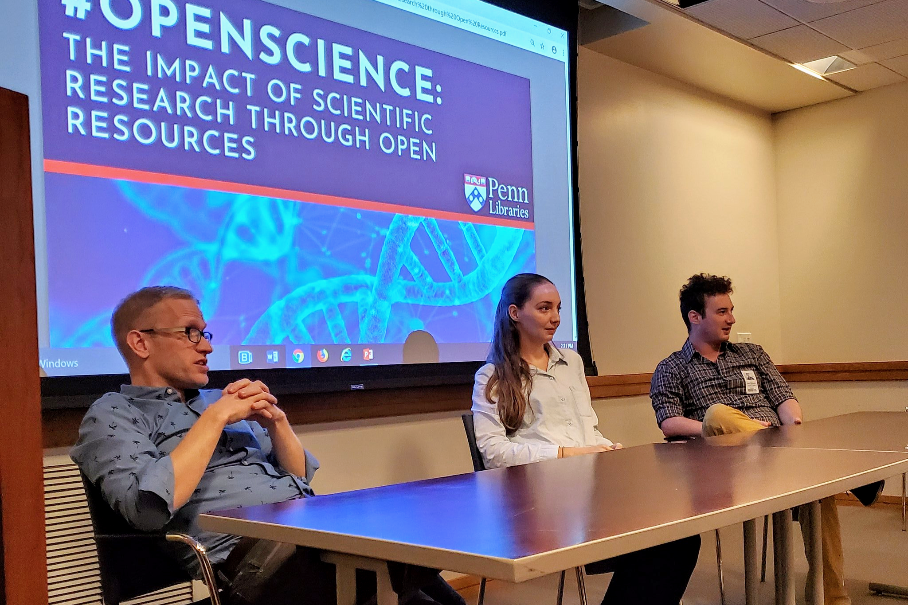

Last week, I got to attend [a series of presentations](https://libcal.library.upenn.edu/calendar/wicshops/openscience) followed by a panel discussion on **open science** at Penn Van Pelt-Dietrich library during the Open Access week. The panel featured (from left to right) [Ted Satterthwaite](https://www.satterthwaitelab.com/), [Jennifer Sisto](http://www.jenniferstiso.com/), [Daniel Himmelstein](dhimmel.com) – all initiated enlightening discussions around different aspects of open science.

{width=100%}
{}Photo credit: [Rebecca Miller](https://twitter.com/RebeccaAnne207){}

Jennifer Stiso motivates the *open science* best practices by recapitulating the  reproducibility crisis.
Stiso referenced Tal Yarkoni's blog post [I hate open science](https://www.talyarkoni.org/blog/2019/07/13/i-hate-open-science/) to remark the different values that the open science community holds near and dear:
{}Yarkoni pointed out potential internal conflicts among the set values when we treat open science as a movement or identity, mostly due to the community's heterogeneity. Perhaps I don't see enough tweets with ongoing arguments about *open science* to understand Yarkoni's frustration. However, I think *open science* is a useful umbrella term even when we focus on not all but only a few values such as reproducibility, accessibility and metascience.{}

> Potential solutions to the [reproducibility problems] now fit under a big umbrella called "open science"
>
> - Reproducibility (reporting clarity, appropriate statistics) 
> - Accessibility (preprints, open access journals) 
> - Incentive Alignment (publishing null results) 
> - Diversity (outreach) 
> - Metascience (reporting clarity) 
>
> Some of these initiatives are in conflict with incentive structures inherent to science, making their widespread adoption difficult (but that doesn't mean we shouldn't try)

Stiso unbundled this definition into smaller chunks and shared the resources that tackle each chunk to help make science more open while facing minimal downsides. Details on these techniques and resources can be found in her slide linked at the end of this post among other relevant links. Two resources I want to highlight:

- Makin and Orban de Xivry's [Ten common statistical mistakes to watch out for when writing or reviewing a manuscript](doi.org/10.7554/eLife.48175)
- [Frontiers for Young Minds](https://kids.frontiersin.org/): an OA scientific journal written by scientists and reviewed by a board of kids and teens{}I'm very intrigued by this one. I would love to submit an article here some time.{}

Complementing these techniques, Ted Satterthwaite provided an impressively concise yet comprehensive list of computational tools for reproducible science:

- Pre-registration of hypotheses (OSF preregistration)
- Standardized naming and directory structures (Brain Imaging Data Structure)
- Version controlled code repositories (GitHub, Bitbucket)
- Analytic notebooks (Jupyter notebook, Rmarkdown)
- Continuous integration testing of software (CircleCI)
- Containerized pipelines (Docker)
- Clear, human-readable wikis (README.md)

Satterthwaite also suggested an interesting model with a “replication buddy” who helps double check whether our analyses are reproducible, from walking through our analytic notebooks to reviewing code and wikis.

Himmelstein delivered a lively talk on the history of [*Manubot*](manubot.org) – a software that supports open collaborative writing – and how it was inspired by the MOOP{}massively open online paper{} codenamed [Deep Review](https://greenelab.github.io/deep-review/). {}Some Github users actually came to this repository's issues section to [request for source codes and datasets](https://github.com/greenelab/deep-review/issues/748#issuecomment-370299092) of the works being referenced in the review paper, which showed how important immediate responses can be.{} He also shared his frustration when encountering legal barriers to reuse data to build the network of biomedical knowledge [Hetionet](https://het.io/), and how that motivated him to open source his products and encourage others to do the same.

I loved how interactive and intimate the discussion was, and the audience raised very relevant and important questions. We requested more details on many aspects; I only took notes of some here:

- *What is continuous integration?* In this context, continuous integration is a way to automatically build the changes we made into the current status of the product. It is commonly used for automatically performing unit tests. In *Manubot*, continuous integration is used to build the living manuscripts *almost immediately* after the edits are merged.
- *Should I be worried that the journal won't consider my article because it has a preprint?* Most journals allow manuscripts that had been previously deposited to a preprint server. We can double check the [list of academic journals by preprint policy](https://en.wikipedia.org/wiki/List_of_academic_journals_by_preprint_policy).
- *What if I do not have permission to make the data I'm analyzing public?* The philosophy here is to be **"as open as possible and as closed as necessary"**. Whether that involves publishing data with derived variables, using checksum, or simply being transparent with the code, do the best you can.

I myself asked one question about challenges in open peer review, and Himmelstein suggested that an incentive for more orthogonal (and correct) opinions may help alleviate the information cascade effect. After thinking about this a bit more, I'm not sure my question was relevant because, after all, with or without open peer review, readers can still openly post what they think on twitter, pubmed or the journal site anyway.

An older audience member commented “I'm fine with this because I'm more senior, but I'm worried for you guys”, and proceeded to explain that perhaps open science should not be the highest priority for junior investigators given the current academic incentives. This is true, and Satterthwaite actually did describe the risks when we do open science: it is time-consuming, the analysis is completely transparent for criticism, and the incentives are misaligned. {}For example, in a [recent presentation](https://twitter.com/jessicapolka/status/1186419519482466304), Anna Hatch showed that researchers think *contribution to open science* is the least important factor in tenure track hiring decisions.{} I think we all agree that doing open science is not without risks. However, I believe, with the changing academic culture (even though very slowly), the benefits will eventually outweigh the risks. A personal benefit was mentioned by Himmelstein in his recent [talk at the 2019 Workshop for Penn's GCB PhD Students](https://youtu.be/F_ghnwG5ejA):

> You may not be the most experienced coder, but the process of sharing & documenting the code & engaging others, will, by the time you complete your PhD, almost certainly result in you having better code than if you didn't.

Doing open science takes time, but that does not mean we shouldn't do it.

### Relevant links
- Talks: [Himmelstein](https://slides.com/dhimmel/penn-oa-panel#/7), [Stiso](http://www.jenniferstiso.com/talks/os_talk.pdf), [Satterthwaite](https://docs.google.com/file/d/1h-ZXmoqvUPDW-wmtoKu66aQkqhpf4DvR/edit?filetype=mspresentation)
- Open science services: [arXiv](https://arxiv.org/), [biorxiv](http://bioRxiv.org/), [PsyArXiv](https://psyarxiv.com/), [PeerJ](https://peerj.com/){}now offers only peer-reviewed OA journal publishing, no more preprints{}, [PubPeer](https://pubpeer.com/), [PREreview](https://www.prereview.org/), [BiOverlay](https://www.bioverlay.org/), [hypothes.is](https://web.hypothes.is/), [The conversation](https://theconversation.com/), [sci-hub.tw](https://sci-hub.tw/)
- Others:
  - [Open licenses](http://opendefinition.org/licenses/)
  - [NIH example for open licensing in your resource sharing plan](https://github.com/lab-carpentry/blueprint-resourcesharing/blob/master/examples/NIH-example.md)
  - Himmelstein's [blog post on the licensing of bioRxiv preprints](https://blog.dhimmel.com/biorxiv-licenses/)
  - [Code and Data for the Social Sciences: A Practitioner's Guide](http://web.stanford.edu/~gentzkow/research/CodeAndData.pdf)

