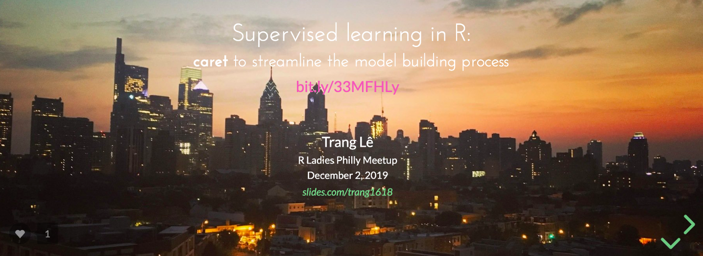
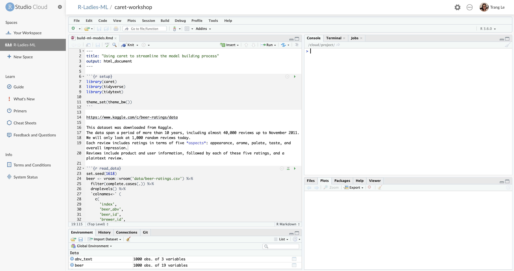

Earlier this month, I had a blast leading a [machine learning workshop](https://www.meetup.com/rladies-philly/events/266229730/) at an R Ladies Philly meetup.
After an introduction to machine learning, we used a [beer review dataset](https://www.kaggle.com/c/beer-ratings/data) to predict the alcohol concentration of beer using the [*caret*](https://topepo.github.io/caret/) R package.
We even dabbled in text analysis. Everyone was awesome and asked many excellent questions throughout! 

I used [RStudio Cloud](https://rstudio.cloud/projects) to facilitate this workshop to avoid any incompatibility with operating systems or nuisance of package installation.
I thought I'd share what I have learned from various [RStudio Community](https://community.rstudio.com/) questions in a single post.
[Slides](https://slides.com/trang1618/caret-rladies) and [code](https://github.com/trang1618/rladies-caret) from the workshop are available if you're interested.

{width=100%}

You see, back in the summer, I had attended an amazing visualization workshop led by [Jake Riley](https://www.linkedin.com/in/jake-riley-70736a3/) at another R Ladies meetup.
We learned the hard lesson that an RStudio space at default is limited to 10 members.
However, one can submit a request to the RStudio Cloud team for more capacity - so I did for 80 members.

All I needed to do after creating a space for the workshop is to go to the Members tab, select *Request More Capacity* and submit the application form.
Within 24 hours, I received an email from Robby Shaver, a member of the RStudio Support Team.

> We've upgraded your account so you should be all set.

This was nice and easy.
However, besides this confirmation, I do not have any other way to confirm this capacity upgrade.
Nowhere on the project site did I see the number of members was set to 80, so I just had to trust the email.
But Robby was also kind enough to warn me about another limitation.

> We currently limited the available RAM for each project to 1 GB, and I just wanted to be sure you were aware of that, given your topic is machine learning, in case that limit is too low for what you'll need.

This RAM limitation fortunately did not pose an issue for me.
I only used CRAN packages which were cached and served in binary format, so I didn't have to compile them.
I also did not use the full dataset (only 1000 random rows), so RAM wasn't really an issue.

The last thing I needed to do, as suggested by Jake, was to link this to a Github repository.
{}This repo would serve as a back-up option in case RStudio Cloud does not work and remain as an accessible resource après workshop even if the cloud space is removed.{}
Now, I have never done this.
I often either initialize a project with Git from the beginning or use RStudio to facilitate work on an existing repo.
As it turned out, it was quite simple.
On the RStudio Cloud project page, Tools &rarr; Global Options &rarr; Git/SVN &rarr; View Public Key and use this key (which should start with `ssh-rsa`) to create your Github New SSH key.
From there, we can create a new repo on Github and set origin as usual (a neat trick is to switch the Console panel to Terminal right on the project page).

``` {bash, eval = F}
git remote set-url <remote-name> <remote-url>
```

Finally, I made the project an *assignment* according to [the Cloud Guide](https://rstudio.cloud/learn/guide).
This allows each attendee to have a copy of their work.
So, if there is still available space, you can go to the link provided in the cover slide, sign in RStudio Cloud with either your Gmail or Github login information, and you will see something similar to this:

{width=100%}

There you have it!
This approach worked really well for my short, one-time workshop.
But if you have time for your students to familiarize themselves with the cloud space and package installation, [others have suggested](https://community.rstudio.com/t/using-rstudio-cloud-for-r-training-courses/11511/6) creating your materials in a zipped file for students to download and reupload on their own space.

Let me know if you have a preferred method for your workshop!
I know RStudio Cloud is continually being improved upon, but hopefully this post will prove useful to some of you before it becomes obsolete.

*P.S.* Max Kuhn, the author of the *caret* package himself, suggested that the beer review dataset be used in an example of Emil Hvitfeldt's [*textrecipes*](https://github.com/tidymodels/textrecipes) package.
Of course, Max!